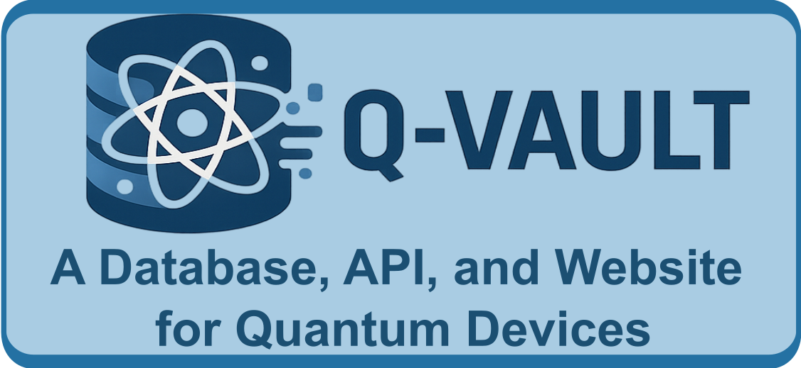

<p align="center">
  
</p>

⚛️ Q-Vault starter template for building a full-stack web application with FastAPI, Streamlit, and PostgreSQL using Docker ⚛️

## Installation

#### Pre-requisites

- Ensure that you have Docker Desktop installed and running on your machine. You can download it from [Docker's official website](https://www.docker.com/products/docker-desktop).
- For development, ensure you have Python 3.8+ installed on your machine. You can download it from [Python's official website](https://www.python.org/downloads/). Include pip/pipx in the installation.
- Ensure you have `poetry` installed. You can install it using `pipx`:
```bash
pipx install poetry
```

#### Project Setup

To setup the project (once the pre-requisites are met), follow these steps:

First, handle environment files
```
cp .env.example .env
```
Look at `.env` and update any variables as needed. 

Then, run the following commands in your terminal:

```
# installs dependencies 
poe install

# starts all docker containers
poe start 

# runs database migrations + initial seed 
poe migrate-generate 
poe migrate-apply
poe seed
```

Now, you should see the containers running in **Docker Desktop**. You 
can start the whole system at any time using `poe start`

Look at **Docker Desktop** to determine what ports to visit. The default locations are:

```
FastAPI backend: http://localhost:8000
Streamlit frontend: http://localhost:8501
```

## ⚙️ Tech Stack

- [**FastAPI**](https://fastapi.tiangolo.com/)  
  Backend web framework with async support.

- [**Streamlit**](https://streamlit.io/)  
  Frontend application framework for building interactive Python apps.

- [**PostgreSQL**](https://www.postgresql.org/)  
  Production-grade relational database.

- [**Docker Compose**](https://docs.docker.com/compose/)  
  For defining and running multi-container Docker applications.

- [**Poetry**](https://python-poetry.org/)  
  Dependency and virtual environment manager for Python.

- [**Alembic**](https://alembic.sqlalchemy.org/en/latest/)  
  Database schema migration tool for SQLAlchemy.

- [**SQLAlchemy**](https://www.sqlalchemy.org/)  
  Core database toolkit and ORM for Python.

- [**Poe the Poet**](https://github.com/nat-n/poethepoet)  
  Task runner that integrates cleanly with Poetry.

## 🚀 Next Steps

Here are some suggested next steps for extending the project:

- **Fix the Q-Vault banner**
  It's so low quality! Replace `assets/qvault.png` with a higher resolution image.

- **Add more SQLAlchemy models**  
  Create new model classes inside `backend/models/` and import them into `backend/db/base.py` so Alembic can detect them for migrations.

- **Create new API routes in FastAPI**  
  Add route files to `backend/app/api/routers/` and include them in the main router using `include_router`.

- **Implement CRUD operations**  
  Add `CRUD` utility functions (e.g., `get_user_by_email`, `create_user`) to interact with the database using SQLAlchemy sessions.

- **Improve the Streamlit frontend**  
  Build interactive dashboards or control panels that query your FastAPI backend and display live results or visualizations.

- **Add request validation and schemas**  
  Use `pydantic` models to validate inputs and serialize outputs in FastAPI endpoints.

- **Integrate authentication**  
  Add user authentication using OAuth2, JWTs, or session-based auth depending on your needs.

- **Write unit and integration tests**  
  Add test coverage for your API routes, database logic, and frontend interaction using tools like `pytest`.

- **Configure CI/CD pipeline**  
  Automate testing, building, and deployment using GitHub Actions or another CI provider.


